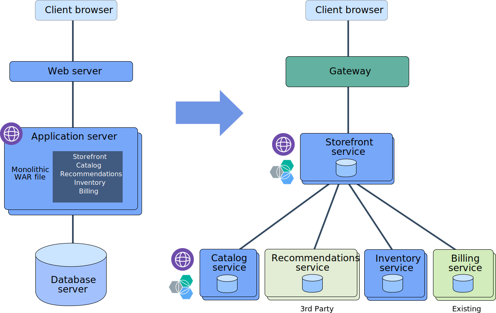
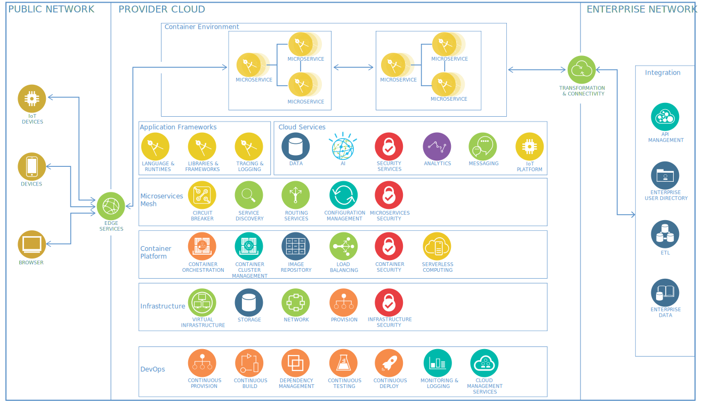
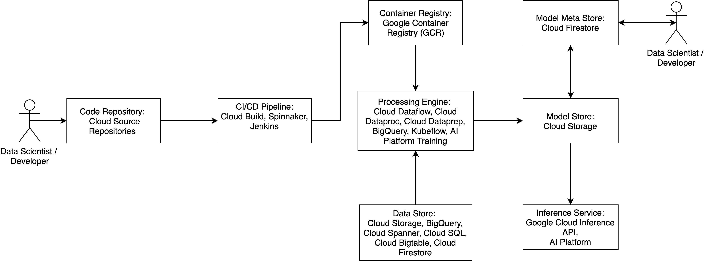
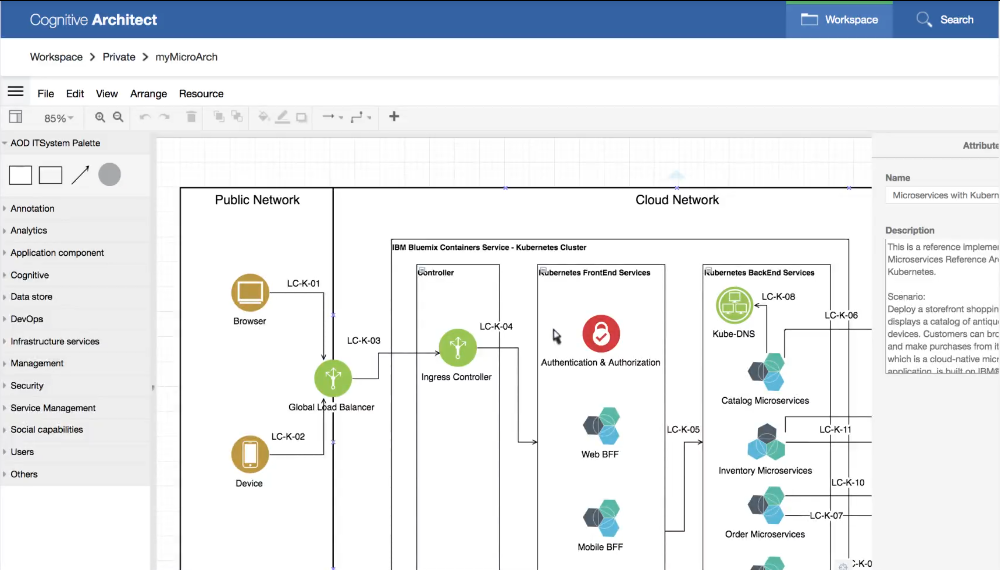

# Data Science - Best Practices

## Table of Content

- [Chapter 1 - Introduction](./readme.md#chapter-1---introduction)
- [Chapter 2 - Project Team (Design)](./project_team.md#chapter-2---project-team)
- [Chapter 3 - Architecture (Deploy)](./architecture.md#chapter-3---architecture)
- [Chapter 4 - Source Code (Engineer)](./source_code.md#chapter-4---source-code)
- [Chapter 5 - Documentation (Engineer)](./documentation.md#chapter-5---documentation)
- [Chapter 6 - Versioning (Engineer)](./versioning.md#chapter-6---versioning)
- [Chapter 7 - Data Management (Engineer)](./data_management.md#chapter-7---data-management)
- [Chapter 8 - Dependency Management (Engineer)](./dependency_management.md#chapter-8---dependency-management)
- [Chapter 9 - Configuration Management (Engineer)](./configuration_management.md#chapter-9---configuration-management)
- [Chapter 10 - Testing (Engineer)](./testing.md#chapter-10---testing)
- [Chapter 11 - Quality Measurements (Monitor)](./quality_measurements.md#chapter-11---quality-measurements)
- [Chapter 12 - Model Training (Engineer)](./model_training.md#chapter-12---model-training)
- [Chapter 13 - Distribution (Deploy)](./distribution.md#chapter-13---distribution)
- [Chapter 14 - Cloud-Deployment (Deploy)](./cloud_deployment.md#chapter-14---cloud-deployment)
- [Chapter 15 - Edge Deployment (Deploy)](./edge_deployment.md#chapter-15---edge-deployment)
- [Chapter 16 - Monitoring (Monitor)](./monitoring.md#chapter-16---monitoring)
- [Chapter 17 - Automation (Scalability)](./automation.md#chapter-17---automation)
- [Chapter 18 - Scaling (Scalability)](./scaling.md#chapter-18---scaling)
- [Chapter 19 - Sizing (Scalability)](./sizing.md#chapter-19---sizing)
- [Chapter 20 - Security (Engineer)](./security.md#chapter-20---security)
- [License](./LICENSE.md)

## Chapter 3 - Architecture

Architecture  - more specifically IT architecture - describes the components that together form the solution. 
It describes what these components do and how they interact with each other.
The architecture for a project is designed / developed by IT architect(s).
Since it's the blueprint for the solution it is crucial for all project members to have some level of understanding of the architecture - especially for technical roles.

> Architecture is a specification of static and dynamic behaviour of a system in a specific context.

In this chapter several reference architectures are shown. A reference architecture is a generic form of architecture, which contains the typical components but is not specific to an exact use case / project. As such they encapsulate well-working and established concepts.

> A reference architecture basically describes the best practices for a certain type of architecture problem.

IT architects use reference architectures as a basis for their project specific architecture and adjust it to the specific needs of the project.

[Learn more about Interfaces](./interfaces.md)

### Application Architecture

The most common architectures you will see are application architectures, which describe the solution's blueprint **in production**.
It describes the final result once the solution is live and used by actual users; it doesn't describe how you get there.
Removing / Ignoring e.g. the development components reduces the level of complexity and keeps the architecture somewhat simple and understandable.

As an introduction into application architecture, we'll look at architectures for web application, since this is one of the most common types of applications. Other types e.g. mobile application usually have similar architecture but are much more complex.

#### 3-Tier Architecture

One of the most established reference architectures is the 3-tier architecture (sometimes also multi-tier architecture):
In this architecture the solution is divided in 3 distinctive layers / tiers.

- The **presentation layer** provides the user interface (UI).
It visualizes the website to the user and accepts their inputs (clicks, typed input, etc.).
Based on the user inputs it triggers the business logic on the business layer.
  - *Web shop example:*
  The website of the web shop is hosted on the presentation layer.
  If you click to add a product to your cart, then the website reaches out to the business layer

- On the **business layer** (or **application layer**) the business functionality is hosted and executed.
It provides interfaces for the presentation layer to trigger certain actions.
The business logic computes the answer and returns it to the presentation layer for visualization.
For some of the calculations the business logic may require some data, for which it will reach out to the data layer.
  - *Web shop example:*
  The business functionality to check if a certain product is in stock is hosted on the business layer.
  The business layer receives the desired product and quantity from the frontend.
  It will ask the data layer for the current in stock quantity and verify if sufficient quantity is in stock.
  It sends the result back to the presentation layer.

- The **data layer** manages the stored data. Its main job is to make the data accessible for business functionality and to maintain data consistency. It is important to note that there is usually no direct connection between the data layer and the presentation layer.
  - *Web shop example:* The data layer may be implemented by a small SQL database. When the business layer asks for the current in stock quantity, the database looks up the number and returns it to the business layer for computation.

In software design there is a similar pattern to this architecture called MVC pattern (model view controller pattern).
The model is comparable to the data layer, the view is comparable to the presentation layer and the controller comparable to the business layer.
The main difference is level where they are applied to:
MVC pattern is usually use on individual class level, e.g. a Python class.

On the left side of the image below you can see a example for the 3-tier architecture.
Note: Since the client browser is not under our control it is not counted as a separate layer.

3-Tier Architecture vs. Micro Services Architecture

#### Micro Services Architecture

Micro service is an application architectural style in which an application is composed of many discrete, network-connected components called 'micro services'.
Instead of splitting the application by technology (presentation, business logic or data), the application is split by different business functionality.
Each of these services offers an web interface, which can be use / consumed by other micro services. The different micro services are connected via network.

> *Web shop example:*
> Instead of having the in stock check stretched across tow layers, it is bundle with other inventory related functionality into a inventory micro service.
> This inventory micro service would then be used / consumed by a cart service, when the user tries to add a certain item to their cart.

Because of their smaller size micro services tend to be better scalable and are usually easier to [deploy on the cloud](./cloud_deployment.md#chapter-14---cloud-deployment).
This is why a lot of organizations have adopted them, however as always there is no 'one size fits all' for architecture.

On the right side of the image in the previous a simple example of a micro services architecture is shown.
The image below shows the IBM reference architecture of micro services.

Micro Services Architecture - High Level

> **Caution** 
> Since every time one micro service calls another micro service a network request is created, having a huge number of very small micro services will cause a lot of network traffic and latency - basically making your application super slow. 
> *Rule of thumb:* For comparison [Netflix has ~700 micro services](https://link.medium.com/nrVHoTubx2) for their whole solution. Compare your application's size to Netflix and then extrapolate your estimated amount of micro services.

One concept closely related to micro services is the '*twelve-factor app*'. It basically describes what to consider when building an app-as-a-service. This is very similar to a micro service, which is why (some of) its ideas are often re-used when developing micro services.

For more details on this topic:

- [IBM Architecture Center Micro Services - https://www.ibm.com/cloud/garage/architectures/microservices/overview](https://www.ibm.com/cloud/garage/architectures/microservices/overview)
- [The Twelve Factor App - https://12factor.net/](https://12factor.net/)

### Deployment Architecture - Pipelines

### Workflow of machine learning pipeline

- Commit code:
  - **Action**: Data Scientist/Developer updates training code in IDE, after changes are made, they are committed
  - **Parameters**: None
  - **Result**: CI/CD pipeline is triggered, automated tests are executed, package is built and published.
- Trigger docker image creation:
  - **Action**: Data Scientist/Developer finished changes on the training code and triggers a build of docker image including the training code.
  - **Parameters**: Version of training code
  - **Result**: The docker image is built containing the package including executable training code.
  Image is deployed to the repository.
- Trigger training:
  - **Action**: Training process is triggered by Data Scientist
  - **Parameters**: DataVersion, TrainingImageVersion, ValidationSetVersion
  - **Result**: Training process is executed on processing service - referenced training image, data set and validation data set is pulled from container image repository and processed.
  Trained models are published to to the model store. Meta data (KPIs) are published to the meta data store.
- Trigger inference:
  - **Action**: Data Scientist triggers the inference (publishing) of the model from model store.
  - **Parameters**: ModelVersion
  - **Result**: Model is pulled from model store and consecutively hosted by the inference service via an API.
  Incoming requests need to contain input data, which is applied to the loaded model, the result is returned as a reply.

### AWS agnostic architecture machine learning pipeline

#### CodeCommit

AWS CodeCommit replaces a conventional git repository - this is the essential place where all of the used code of a
project is stored. The repository will contain the following files as a basic structure:

- **CI/CD** Scripts for building and deploying code - these can be accessed and executed in CodeDeploy and CodeBuild.
- **docker** folder which contains the docker files, which are necessary to build the docker image containing the
    training code. This image will then be executed in AWS SageMaker for example.
- **src** folder contains the source files for training, inference and also tests.
- **build.py** file if you use pybuilder instead if CodeBuild to build a distributable python package.
- **environment.yml** to specify the required packages for a conda environment, which can be deployed anywhere.

#### CodeDeploy/CodeBuild

CodeBuild will run all unit and integration tests, as well as build a tarball from the specified python sources,
which can be deployed into a docker container later.
CodeDeploy will execute a specified deployment scenario, which will e.g. build the docker container, push it to a docker
image repository and in the end load the image in a production setting.

#### AWS ECR

AWS ECR functions as the repository for all docker containers, which are built in the above-mentioned pipeline.
It acts as repository for containers just as CodeCommit acts as a repository for config files and source code.
This is the point where AWS SageMaker will look for a specified docker image, when a training job is triggered with the respective parameters from the outside.

#### AWS SageMaker

AWS SageMaker acts as the runtime environment for all training jobs.
AWS SageMaker can be triggered via an API/python binding.
There a user specifies, what kind of model is to be run and where the respective input and output data is located.
AWS SageMaker will accept docker images with a predefined entry point containing the training code.
However, it is also possible run a TensorFlow/MXNext/ONNX-defined job there.
SageMaker offers a User Interface for administration and can be elastically scaled as it is a managed service.
Therefore, the user can choose from a wide variety of machines, which are used to train a specific model.
AWS SageMaker can also be used to perform Hyperparameter Tuning, which can be triggered via the API as well.
The tool will automatically select the best performing combination of hyperparameters.
The results from a run can be directly written to S3 or even DynamoDB.  

#### AWS S3

AWS S3 acts as the basic file system for input and output files. Usually S3 is used to store large training data files
and can also be used to store serialized models.
AWS S3 seamlessly integrates with SageMaker.

#### AWS DynamoDB

AWS DynamoDB is a key-value based NoSQL database, which is completely managed by AWS and can be scaled on demand.
The database can be used to hold the KPIs from a model run to track model performance over time for example.
It is also leveraged to integrate runtime information and performance meta data for a model run.
AWS DynamoDB can be seamlessly integrated with QuickSight, which is a data visualization tool offered by AWS.

#### AWS Elastic Inference

AWS Elastic Inference is an EC2 instance on steroids. Models trained in AWS SageMaker can be hosted on an EI instance for prediction. The underlying machine(s) can be scaled on demand.

### GCP agnostic architecture machine learning pipeline

#### Google Cloud Source Repositories

Cloud Source Repositories are private Git repositories hosted on the Cloud Platform.

#### Google Cloud Build

Google Cloud Build lets you build software quickly across all languages. Get complete control over defining custom workflows for building, testing, and deploying across multiple environments such as VMs, serverless, Kubernetes or Firebase.

#### Spinnaker & Jenkins

Besides Google Cloud Build you can also setup your Instance of Spinnaker or Jenkins on GCP

#### Google Container Registry

Google Container Registry is a private Docker image repository, that integrates well with Cloud Build and provides access controls.

#### Google Cloud AI Platform

The Google Cloud AI Platform (formerly Cloud Machine Learning Engine) is a managed service that lets developers and data scientists train and run superior machine learning models.
It has seamless integration into Google Cloud Storage and provides utilities for managing and supervising training jobs. Training with a Cluster and/or GPU’s is also supported (beta).
It provides possibilities for automatic hyperparameter tuning.
A finished model can then be deployed in the service, which then allows you to get batch and online predictions.

Limitations: Only supported Frameworks are:

- TensorFlow
- Keras
- XGBoost
- scikit-learn
- (beta: custom containers)

#### Kubeflow

Kubeflow is a OpenSource Platform for machine learning workflows. It runs on Kubernetes and is therefore Cloud Platform agnostic.
But as Kubeflow was open-sourced by Google a lot of the Tutorials and Documentation is still with Google Cloud Platform.

#### Google Cloud Storage

Google Cloud Storag is a standard S3 storage service. It acts as the basic file system for input and output files. Usually S3 is used to store large training data files and can also be used to store serialized models. Google Cloud Storage seamlessly integrates with Cloud Machine Learning Engine.

#### Google Firestore

Cloud Firestore is the next major version of Cloud Datastore and a re-branding of the product. Taking the best of Cloud Datastore and the Firebase Realtime Database, Cloud Firestore is a NoSQL document database built for automatic scaling, high performance, and ease of application development.

For a more in-depth comparison of the data persistance solutions check out this [article](https://weidongzhou.wordpress.com/2017/06/10/google-cloud-sql-vs-cloud-datastore-vs-bigtable-vs-bigquery-vs-spanner/).

### Microsoft Azure agnostic architecture machine learning pipeline

#### Azure Repositories

Azure tracks information from a local git repository. GitHub, GitLab or other git services can be used.
The git repository has to be cloned into the shared file system of the azure workspace. 

#### Azure Pipelines for CI/CD

Azure Pipelines can be used to automatically train and deploy machine learning models. 

#### Azure Container Registry

Azure Container Registry is a registry of Docker and OCI (Open Container Initiative) images for container lifecycle management. It is compatible with environments like Azure Kubernetes Service or Azure Red Hat OpenShift and other Azure Services. 

#### Azure ML Service

Azure ML Service is a cloud based environment to train, deploy, automate, manage and track ML models. 
The Workflow consists of five phases:
- Train - Deploy machine learning scripts with a compute target in an environment
- Package - Register the model in the registry
- Validate - Query the experiment
- Deploy - Deploy the model
- Monitor - Monitor for data drift and interference

#### Azure Blob Storage

Azure Blob Storage is an object storage for cloud-native workloads and machine learning. Resources stored in the storage account are divided into containers which contain the blobs. 
Block blobs store text and binary data up to 4.75 TiB of data, Append blobs are Block blobs optimized for append operations and Page blobs store random access files up to 8TB in size serving as disks for virtual machines.

#### Azure Cosmos DB

Azure Cosmos DB is a globally distributed, multi-model database service. Cosmos DB provides support for NoSQL and OSS (Open Storage Service) APIs like MongoDB, Cassandra, etc.

#### Azure Container Instance

Azure Container Instance is a lightweight service to run containers in the Azure Cloud. Container Instance can be used for isolated containers, simple applications, task automation and build jobs. For bigger scenarios Azure Kubernetes Service is recommended, because it supports full container orchestration, scaling, service discovery, etc. 

### Open source architecture machine learning pipeline

#### GIT

GIT acts as the main source of truth by representing the current code, infrastructure, tests and deployment plans.
The current infrastructure setup as well as code version should be visible in the repository.

#### Jenkins

Jenkins can be utilized as build server, which executed pre-defined scripts hosted on GIT.

#### Nexus

Nexus holds the code artifacts (e.g. Python eggs, Java Beans) in all published versions.
Also the built container images are hosted here to be retrieved by the processing engine.

#### Kubernetes/Docker host

There is a large variety of potential tech stacks for this part.
For hosting a training session different levels of complexity can be introduced (from low to high):

- Docker host: A simple docker host can run container, which contains the training (or any other) code. Multiple hosts can be managed
and scaled by introducing Hashicorp's Nomad for orchestration.
- Kubernetes cluster: Deployment, orchestration, scaling, registry etc. can be implemented by leveraging a Kubernetes cluster.
The cluster can run on any hardware and host training (or any other) code containers. Kubernetes supports the whole
lifecycle of the specific container.
- Kubeflow: The Google driven open source project aims at a scalable Machine Learning pipeline running on a Kubernetes cluster.
Kubeflow offers the possibility to create machine learning flows containing mutual dependencies and parameters.
It will automatically execute steps of a pre defined pipeline (data prep before training) and schedule containers automatically.
Kubeflow can also be hosted on a GCP environment.

#### Data Sources

Data sources can be anything from CSV to raw text files, SQL or NOSQL databases etc.

#### MongoDB

As a simple JSON object store with support for a large variety of queries (aggregation pipelines for analyses) MongoDB can act as a KPI and metadata store for tracking the results from training runs.
MongoDB is not specifically optimized for Big Data workloads and is therefore a good analytics base layer hosting data for high level dashboards.

#### minio/OpenIO

minio and OpenIO are basic object stores, which can be extended by the AWS S3 API for interaction.
These stores can be used to host the physical model files, as well as training data or other metadata not relevant for further analytics in dashboards.

#### Container + Flask/Falcon

To host a model built in the machine learning pipeline as an endpoint, a RESTful API can be offered to other consuming services.
This complies with a micro service architecture setup. A simple RESTful API can be implemented using the Falcon or Flask API for Python.

### C3 agnostic architecture machine learning pipeline

For GIT and Jenkins see [Open source architecture ML pipeline](./#open-source-architecture-machine-learning-pipeline)

#### C3 AI Suite

C3 AI Suite is a closed system that covers most of the pipeline internally.
It includes dedicated data stores, e.g. SQL DB, object storage, wide-column storage.
It also brings its own compute /execution environment.
Only for versioning and building / automation separate tools are used.

> *Programming Languages:*
> C3 AI Suite uses 3 programming languages:
> C3's custom C3-Types, JavaScript and Python.
> The data model is coded in C3-Types which is only compatible with the C3 AI Suite.
> Methods can be implemented either in Python or JavaScript.
> For consistency we recommend deciding on 1 of them per project.
> For testing JavaScript's Jasmine framework is used.
> Therefore, all tests have to be written in JavaScript.
> It is necessary for developers to be able to program in all 3 languages.
>
> *Environments:*
> Methods and tests cannot be run on a local environment, therefore dedicated C3 AI Suite environment(s) are required for development.
>
> *Data Versioning:*
> Because C3 AI Suite manages the data completely internally, data versioning might be challenging to achieve since it has to be done locally separate from the C3 environment.

For more details on the C3 AI Suite, we recommend the [C3 AI Education Program](https://w3.ibm.com/w3publisher/c3-ai-education-program).

### Digital Insights driven Cognitive  Enterprise (DI-CE)

IBM's reference pattern for data platforms is 'Digital Insights driven Cognitive Enterprise'. For more details, please have read through the [DI-CE white paper](./res/DI-CE.White.Paper.docx).

**DI-CE Architecture Example**

### Cognitive Architect

A handy little tool to document architecture, especially for smaller projects, is Cognitive Architect:

Cognitive Architect - [https://ibm.biz/cogarch-app](https://ibm.biz/cogarch-app)

> Cognitive Architect allows one to create an architecture from scratch or start from an existing reusable reference asset.
> It enables our Architects to innovate and collaborate with their peers and clients, as well as demonstrate IBM capabilities by linking to an initial set of reference implementations.

> Cognitive Architect is a simple tool to assist an Architect in designing a solution by finding the best/relevant/potential architectural solutions and/or patterns and customizing them for client specific needs.

The tool follows IBM's repeatable and consistent approach to developing IT architectures. The tool also helps with documenting functional and non-functional requirements.

For larger projects dedicated architecture software is preferred, e.g. IBM Rational Software Architect. In general: Cognitive Architect is preferred over documenting architecture in Microsoft PowerPoint!

- [Cognitive Architect](https://ibm.biz/cogarch-app)
- [SalesTools@IBM - Cognitive Architect](https://w3.ibm.com/w3publisher/salestools-ibm/cognitive-architect)
- [Lighthouse - Cognitive Architect Introduction](https://w3.ibm.com/services/lighthouse/bluetube/videos/33565)
- [Communities - Cognitive Architect](https://apps.na.collabserv.com/wikis/home?lang=en-us#!/wiki/Wb1a45d7c6be2_4fb0_a8d0_048a4bc91c77/page/Cognitive%20Architect)

### IBM Cloud agnostic architecture machine learning pipeline

#### Git Repositories

Repositories are private Git repositories hosted in the IBM Cloud and built on GitLab Community Edition. GitHub and the Git command line are accessible alternatives to GitLab.

#### IBM Cloud Continuous Delivery

The IBM Cloud Continuous Delivery consists of toolchains that help with the development, deployment and operations tasks. 

#### IBM Cloud Container Registry

IBM Cloud Container Registry stores container images in a private registry. It is used to manage namespaces and images. Images can be pushed to environments like IBM Cloud Kubernetes Service.

#### Watson Machine Learning

IBM Watson Machine Learning is a full-service offering. The machine learning service is a set of REST APIs that can be called from any programming language. Machine Learning Models can be trained inside Watson Machine Learning and can be imported elsewhere. Watson Machine Learning supports frameworks like Spark, scikit-learn, XGBoost, TensorFlow, Keras, Caffe, PyTorch, IBM SPSS Modeler, PMML. 

#### IBM Cloud Object Storage

IBM Cloud Object Storage is a flexible and scalable cloud storage for unstructured data. The data remains in its native format and forms data lakes.

#### IBM Cloud Kubernetes Service

IBM Cloud Kubernetes Service is a container service with Kubernetes. Kubernetes clusters can be created in the IBM Cloud Account. The clusters are accessed via the IBM Cloud CLI.