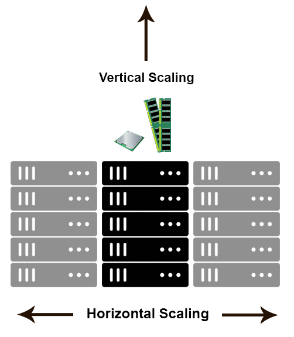

# Data Science - Best Practices

## Table of Content

- [Chapter 1 - Introduction](./readme.md#chapter-1---introduction)
- [Chapter 2 - Project Team (Design)](./project_team.md#chapter-2---project-team)
- [Chapter 3 - Architecture (Deploy)](./architecture.md#chapter-3---architecture)
- [Chapter 4 - Source Code (Engineer)](./source_code.md#chapter-4---source-code)
- [Chapter 5 - Documentation (Engineer)](./documentation.md#chapter-5---documentation)
- [Chapter 6 - Versioning (Engineer)](./versioning.md#chapter-6---versioning)
- [Chapter 7 - Data Management (Engineer)](./data_management.md#chapter-7---data-management)
- [Chapter 8 - Dependency Management (Engineer)](./dependency_management.md#chapter-8---dependency-management)
- [Chapter 9 - Configuration Management (Engineer)](./configuration_management.md#chapter-9---configuration-management)
- [Chapter 10 - Testing (Engineer)](./testing.md#chapter-10---testing)
- [Chapter 11 - Quality Measurements (Monitor)](./quality_measurements.md#chapter-11---quality-measurements)
- [Chapter 12 - Model Training (Engineer)](./model_training.md#chapter-12---model-training)
- [Chapter 13 - Distribution (Deploy)](./distribution.md#chapter-13---distribution)
- [Chapter 14 - Cloud-Deployment (Deploy)](./cloud_deployment.md#chapter-14---cloud-deployment)
- [Chapter 15 - Edge Deployment (Deploy)](./edge_deployment.md#chapter-15---edge-deployment)
- [Chapter 16 - Monitoring (Monitor)](./monitoring.md#chapter-16---monitoring)
- [Chapter 17 - Automation (Scalability)](./automation.md#chapter-17---automation)
- [Chapter 18 - Scaling (Scalability)](./scaling.md#chapter-18---scaling)
- [Chapter 19 - Sizing (Scalability)](./sizing.md#chapter-19---sizing)
- [Chapter 20 - Security (Engineer)](./security.md#chapter-20---security)
- [License](./LICENSE.md)

## Chapter 18 - Scaling

A system is considered scalable when it doesn’t need to be redesigned to maintain effective performance during or after a steep increase in workload. The workload could refer to simultaneous users, storage capacity, the maximum number of transactions handled, or anything else that pushes the system past its original capacity.

### Horizontal vs. Vertical Scaling

**Horizontal scaling** (or scaling out) means that you scale by adding more machines into your pool of resources whereas **Vertical scaling** (or scaling up) means that you scale by adding more power (CPU, RAM) to an existing machine.

An easy way remember this is to think of a machine on a server rack, we add more machines across the horizontal direction and add more resources to a machine in the vertical direction as exemplified in the diagram below.

One way to look at it is to think of vertical scaling like retiring your Toyota and buying a Ferrari when you need more horsepower. With your new Ferrari, you can ride at top speed with the windows down and look amazing. But, while Ferraris are great, they’re not very practical, they’re expensive, and at the end of the day, they can only take you so far before they’re out of gas.

Horizontal scaling gets you that added horsepower – not by ditching the Toyota for the Ferrari, but by adding another vehicle to the mix. In fact, you can think of horizontal scaling like several vehicles you can drive all at once. Maybe none of these machines is a Ferrari, but no one of them needs to be: across the fleet, you have all the horsepower you need.

> Horizontal scaling is almost always more desirable than vertical scaling because you don’t get caught in a resource deficit, or in other words, there is a harder limit to scaling up than to scaling out. Think about it, when we talk about distributed/parallel computing we are in fact, talking about horizontal scaling. 

#### Which one to choose

**When to choose Vertical scaling** 
- You need to overcome node-level performance limitations, i.e., store large files that cannot be split into smaller parts across different nodes or execute some computation that cannot be parallelized.
- You need help in handling repeatedly increasing workloads. 
- Your client has a relatively small data set. 
- You do not expect the dataset to grow significantly over time. 

**When to choose Horizontal scaling**
- The scale-up approach does not deliver the necessary level of performance
- You need to distribute storage or analytics workload across multiple nodes
- Your client has a lot of data (At least several Terabytes and up)
- You expect a significant but steady data growth over time

### Concurrency

Concurrency is that concern when two or more things are being done simultaneously or near simultaneously. These concurrent processes may or may not be using the exact same resources. Two very important concepts to understand concurrency are coordination and synchronization.

Coordination starts with the resource allocation to the entities carrying out individual tasks and the distribution of the workload among them. This initial phase is followed by communication during the execution of the tasks, and finally, by the assembly of individual results. Synchronization is another defining aspect of concurrency. The importance of synchronization is best illustrated by the famous dining philosophers problem, see The diagram below.

> Five philosophers sitting at a table alternately think and eat. A philosopher needs the two chopsticks placed left and right of her plate to eat. After finishing eating she must place the chopsticks back on the table to give a chance to her left and right neighbors to eat. The problem is non-trivial, the naive solution when each philosopher picks up the chopstick to the left, and waits for the one to the right to become available, or vice versa, fails because it allows the system to reach a deadlock state, in which no progress is possible. Deadlock would lead to philosopher starvation, a situation that must be avoided. This problem captures critical aspects of concurrency such as mutual exclusion and resource starvation.

Broadly speaking concurrency issues fall into two subcategories. The first issue is that of the concurrency of user traffic. It is important to quantify the number of users that will be using the application at the same time and in what manner (i.e., what kind of transaction or reporting activity is taking place). Is it 300 users per day or per hour? Are they doing simple queries or complex ones? Are they doing reporting with queries that produce bulk result sets that will be subreported on?

The second issue of concurrency is how many internal types of accesses will be using the same set of database objects at the same time. While these two are related, the second has to do with managing the integrity of data within the objects. This is of immense concern with the management of data when online transactions are performed.

One way to battle concurrency was already discussed and is the use of horizontal scaling. In the next section we will explore some other ways in which we can scale while accounting for concurrency.

### Stateful vs. Stateless

We generally talk about Stateful adn Stateless when talking about microservices. The key difference between stateful and stateless microservices is that stateless microservices don’t store data on the host, whereas stateful microservices require some kind of storage on the host who serves the requests.

> Keeping the state is critical for a stateful service. On the other hand, a stateless service can work using only pieces of information available in the request payload, or can acquire the required pieces of information from a dedicated stateful service, like a database.

By their definitions you might have already noticed that when our goal is to scale our application, that a Stateless architecture provides several advantages, for example, consider the previously discussed topic of concurrency. 

In a Stateful application when the volume of concurrent users grows in size, more servers run the applications added, and load distributed evenly between those servers using a load-balancer. But since each server ‘remembers’ each logged-in user’s state, it becomes necessary to configure this load balancer in ‘sticky-mode.’ While distributing load across servers, the load-balancer required to send each user’s request to the same server that responds to that user’s previous request, to process the request correctly which defeats the purpose of load balancing.

On the other hand, in a Stateless application, the server-side logic coded in such a way that it does not depend on the previously-stored state of the client. The state information is sent along with each request to the server after which the server proceeds with servicing the request. This provides several benefits such as:

- Removes the overhead to create/use sessions.
- Wickedly scales horizontally needed for modern user’s needs.
- New instances of an application added/removed on demand.
- It allows consistency across various applications.
- Statelessness makes an application more comfortable to work with and maintainable.
- Reduces memory usage at the server-side.
- Eliminates session expiry issue – Sometimes expiring sessions cause issues that are hard to find and test. Stateless applications don’t need sessions & hence they don’t suffer from these.
- From the user’s side, statelessness allows resources to be linkable. If a page is stateless, then when the user links a friend to that page, ensures the user to view the same as another user viewing.

> Docker and Kubernetes are prime examples of tools that can help deploy and operate a Stateless application

### Examples

To find examples for these guidelines, go to the example repository: [MLOps pipeline](https://github.ibm.com/datascience-ibm/example-mlops-model-pipeline).

In the practical application we have been working on scaling is achieved in a number of ways. For example we leverage containers and container orchestration tools like Docker and Kubernetes and we deploy and run them on an [AWS EKS cluster](https://aws.amazon.com/eks/) which provides a number of autoscaling capabilities.

In fact the concept of Elastic computing is absolute key in this regard since it allows us to spin up resources while we  are performing operations and turn them off when we are not.
